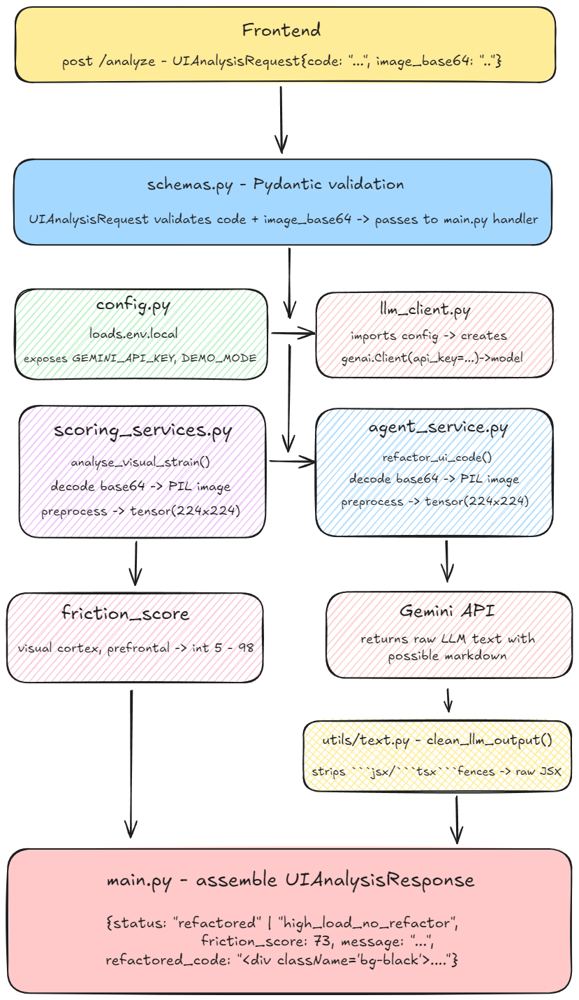

<div align="center">

```
                      ██████╗ ██████╗ ██████╗ ████████╗███████╗██╗  ██╗
                     ██╔════╝██╔═══██╗██╔══██╗╚══██╔══╝██╔════╝╚██╗██╔╝
                     ██║     ██║   ██║██████╔╝   ██║   █████╗   ╚███╔╝ 
                     ██║     ██║   ██║██╔══██╗   ██║   ██╔══╝   ██╔██╗ 
                     ╚██████╗╚██████╔╝██║  ██║   ██║   ███████╗██╔╝ ██╗
                      ╚═════╝ ╚═════╝ ╚═╝  ╚═╝   ╚═╝   ╚══════╝╚═╝  ╚═╝
```


**Zero cognitive load, by design.**

[](https://python.org)
[](https://fastapi.tiangolo.com)
[](https://nextjs.org)
[](https://typescriptlang.org)

</div>

---

## What is Cortex?

Cortex is an **in-silico cognitive load balancer and auto-remediation engine** for UI/UX code. It replaces subjective design opinions with hard neuroscience data.

Instead of "I think this looks cluttered," Cortex tells you:

> *"The simulation predicts an 88% spike in visual cortex strain."*

It feeds your UI components into **Meta's TRIBE v2** — a trimodal neural simulation model — to predict the exact BOLD (blood-oxygen-level-dependent) signals that would fire in a real human brain when viewing your interface. If those signals indicate cognitive overload, an autonomous AI agent **instantly rewrites your code** into a mathematically optimized, zero-friction layout.

---

## Core Technology: TRIBE v2
Meta's TRIBE v2 (TRImodal Brain Encoder) is a breakthrough in in-silico neuroscience. It is a transformer-based architecture that integrates features from text, video, and audio to predict brain activity across the human cortical surface.

### Key Breakthroughs
*   **Neural Prediction:** Predicts how approximately 70,000 brain voxels respond to any digital input.
*   **Zero-Shot Capability:** Understands brain responses for tasks and designs it has never seen before.
*   **Biologically Grounded:** Built on over 1,100 hours of fMRI data from hundreds of subjects.

---

## How It Works

```
Developer pastes UI code
         │
         ▼
  Frontend (Next.js)
  renders it in a hidden div
  → html2canvas snaps a Base64 screenshot
         │
         ▼
  Orchestrator (Node.js / Express)
  routes screenshot to Brain Node
         │
         ▼
  Brain Node (FastAPI / Python)
  runs TRIBE v2 neural simulation
  → predicts Visual Cortex + Prefrontal activation
  → returns friction_score (0–100)
         │
         ▼
  Score > 75?
  ├── YES → Vision LLM refactors the code
  │         (strips div-hell, fixes contrast,
  │          rewrites aesthetically as per user request)
  └── NO  → NOMINAL. Ship it.
         │
         ▼
  Frontend updates:
  3D brain glows red or cyan
  Telemetry graph spikes or flattens
  Diff view shows original vs. optimized code
```
### Workflow: 



---

## Architecture

Cortex is split into **three decoupled microservices**:

### Brain Node — `backend/` (Python / FastAPI)
The neuroscience simulator. Receives a Base64 UI screenshot, runs it through Meta TRIBE v2, averages voxel activation across brain regions (Visual Cortex, Prefrontal Cortex), and returns a `friction_score`.

- **Stack:** Python, FastAPI, Meta TRIBE v2, PyTorch, ResNet18 (fallback)
- **Fallback:** If TRIBE v2 is unavailable or times out (30s), ResNet18 activations are used as a proxy score.

### Orchestrator — `server/` (Node.js / Express)
The central nervous system. Routes data between the frontend and Brain Node, evaluates the score threshold, and calls the Vision LLM for code refactoring when overload is detected.

- **Stack:** Node.js, Express, Gemini 1.5 Pro

### Mission Control — `client/` (Next.js)
The aerospace terminal dashboard. Captures live screenshots client-side, visualizes brain telemetry in real-time, and displays the code diff.

- **Stack:** Next.js, TypeScript, Tailwind CSS, Monaco Editor, Spline (3D WebGL), Recharts, html2canvas

---

## The Science

TRIBE v2 (Trimodal Brain Encoder) is a neural simulation model from Meta that acts as a **digital twin of the human brain**. When fed visual input, it predicts the neural activity that would occur in specific brain regions:

| Region | What it measures |
|---|---|
| **Visual Cortex** | Raw visual complexity — contrast, clutter, motion noise |
| **Prefrontal Cortex** | Cognitive effort — decision load, information hierarchy |

Cortex blends these into a single **Cognitive Friction Score (0–100)**:

```
friction_score = (visual_cortex × 0.6) + (prefrontal_cortex × 0.4) × 100
```

| Score | Status | Action |
|---|---|---|
| 0 – 40 | 🟢 NOMINAL | No intervention |
| 41 – 75 | 🟡 ELEVATED | Monitor |
| 76 – 100 | 🔴 CRITICAL OVERLOAD | Auto-refactor triggered |

---

## Getting Started

### Prerequisites

- Python 3.10+
- Node.js 18+
- A CUDA-capable GPU (recommended for TRIBE v2)
- Gemini API key

### 1. Clone

```bash
git clone https://github.com/projectakshith/Cortex.git
cd Cortex
```

### 2. Brain Node Setup

```bash
cd backend
pip install -r requirements.txt
```

Create `.env.local`:

```env
GEMINI_API_KEY=your_gemini_api_key_here
DEMO_MODE=False
```

Start the Brain Node:

```bash
uvicorn main:app --host 0.0.0.0 --port 8000 --reload
```

Verify TRIBE v2 is working:

```
GET http://localhost:8000/api/diagnostics/tribe
```

### 3. Orchestrator Setup

```bash
cd server
npm install
npm run dev
```

### 4. Frontend Setup

```bash
cd client
npm install
npm run dev
```

Open [http://localhost:3000](http://localhost:3000).

---

## API Reference

### Brain Node (`localhost:8000`)

| Method | Endpoint | Description |
|---|---|---|
| `GET` | `/health` | System status + LLM availability |
| `GET` | `/api/diagnostics/tribe` | TRIBE v2 load + inference check |
| `POST` | `/api/analyze` | Full pipeline: score + optional refactor |
| `POST` | `/api/brain-score` | Raw TRIBE v2 scoring for text/video/audio |

**`POST /api/analyze` payload:**
```json
{
  "code": "<your React/Tailwind code>",
  "image_base64": "data:image/png;base64,..."
}
```

**Response:**
```json
{
  "status": "critical",
  "friction_score": 88,
  "message": "CRITICAL OVERLOAD — Friction Score: 88/100. Code auto-refactored.",
  "refactored_code": "<optimized JSX here>"
}
```

Interactive docs available at `http://localhost:8000/docs`.

---


## Demo Mode

Set `DEMO_MODE=True` in `.env.local` to run without a Gemini API key. The scoring pipeline still runs fully via TRIBE v2 (or ResNet fallback), but the refactored code output will be a placeholder rather than a live LLM rewrite.

---

## GPU Note

TRIBE v2 is a large model. For best performance:

```bash
# CUDA 12.1
pip install torch torchvision --index-url https://download.pytorch.org/whl/cu121

# Then install the rest
pip install -r requirements.txt
```

CPU inference works but will be significantly slower and may hit the 30s timeout, triggering the ResNet fallback.


